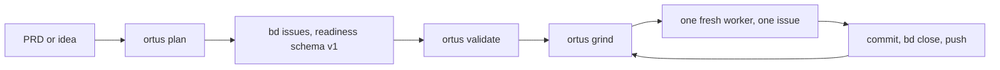

# Ortus

[](https://github.com/who/ortus/actions/workflows/test.yml)

*Ortus* (Latin: "rising, origin, birth"), the point from which something begins.

Ortus autonomously closes a backlog of bd-tracked issues using Claude Code, Codex, Grok, or a model you serve yourself, one fresh subprocess per task. Inspired by the Ralph Loop concept: fresh window per task, drive the queue to zero, no context drift.

## How it works



## Install

**Requires [uv](https://docs.astral.sh/uv/getting-started/installation/) on PATH.** Ortus is distributed via PyPI and installed by uv; we don't auto-install uv.

**One-liner (recommended):**

```bash
curl -fsSL https://github.com/who/ortus/releases/latest/download/install.sh | sh
```

**Direct PyPI:**

```bash
uv tool install ortus
ortus --version
```

**From source / pinned commit:**

```bash
uv tool install git+https://github.com/who/ortus.git
# Pin a specific tag/branch:
uv tool install 'git+https://github.com/who/ortus.git@v0.1.0'
```

**Troubleshooting:**

| Symptom | Fix |
|---|---|
| `uv: command not found` | Install uv: `curl -LsSf https://astral.sh/uv/install.sh \| sh` (see [uv docs](https://docs.astral.sh/uv/getting-started/installation/)) |
| `ortus: command not found` after install | `uv tool update-shell` then open a new shell |
| `bd: command not found` | `brew install beads` (mac) or grab a release from https://github.com/gastownhall/beads/releases |

## Quick start

```bash
# Bootstrap YOUR project
cd your-project
ortus init .

# Verify prereqs for the configured backend
ortus check .

# Decompose a PRD into bd issues
ortus plan . path/to/feature.md

# Or run the idea→interview→PRD→tasks flow with no PRD path
ortus plan .

# Drive the bd queue to zero, one task per fresh agent subprocess
ortus grind .

# Override the project backend for one run
ortus grind . --backend codex

# Bounded: stop after N tasks
ortus grind . --tasks 5

# Prototype bar for one run: lint and syntax checks only, no behavioral tests
ortus grind . --prototype
```

**Note:** Ortus is a global CLI you install once and use everywhere, not a Python dependency. You don't clone this repository into your project. `ortus init` only adds a small set of per-project files to an existing directory, and host prose in `AGENTS.md` and `CLAUDE.md` outside the Ortus markers is left alone. See [agent backends](docs/backends.md).

## Prerequisites

| Tool | Why | Install |
|---|---|---|
| **uv** | install + run ortus | [docs.astral.sh/uv](https://docs.astral.sh/uv/getting-started/installation/) |
| **bd** (beads) v1.0.0+ | issue tracking (Dolt-backed) | `brew install beads` or [GH release](https://github.com/gastownhall/beads/releases) |
| **claude**, **codex**, or **grok** | agent running inside `ortus grind`; Claude is the default | [Claude Code](https://github.com/anthropics/claude-code) / [Codex CLI](https://github.com/openai/codex) / Grok Build |
| **opencode** (`local` is its older name) | any OpenAI-compatible server exposing /v1/models and /v1/chat/completions, driven through the opencode CLI | [opencode](https://opencode.ai) + [llama.cpp llama-server](https://github.com/ggml-org/llama.cpp) |
| **jq** | bd JSON post-processing | `brew install jq` / `apt install jq` |
| **bwrap** (Linux) or **sandbox-exec** (Mac) | OS-level sandbox for `ortus grind` | `apt install bubblewrap` / built into macOS |

Required: **[CodeGraph](https://github.com/colbymchenry/codegraph)**. `ortus init` installs the index and pins `codegraph = "required"`, and `plan`/`grind` abort before launching an agent when it is missing. For a repository CodeGraph cannot index, bootstrap without it using `ortus init --codegraph off`. See [the CodeGraph lifecycle](docs/codegraph.md).

| Platform | Status | Notes |
|---|---|---|
| Linux (Ubuntu/WSL2) | full | requires `bubblewrap` for `ortus grind` |
| macOS | full | Seatbelt (`sandbox-exec`) is built-in |

**Windows is not supported** (decision 2026-05-17). Windows users should run ortus inside **WSL2** (Windows Subsystem for Linux), where ortus runs as a normal Linux process.

## The verbs

| Verb | Purpose |
|---|---|
| `ortus init <repo>` | Bootstrap a fresh repo and pin a concrete run backend in `.ortusrc` |
| `ortus check <repo>` | Verify bd, the run backend, sandbox, backend config, and managed agent files; strictly read-only |
| `ortus plan <repo> [<PRD>]` | Decompose a PRD into bd issues, or interview-then-PRD-then-decompose if no PRD path |
| `ortus ingest <repo>` | File one readiness schema v1 issue from a packet directory or stdin JSON |
| `ortus validate <repo> [<id>...]` | Report whether bd issues satisfy readiness schema v1 before grinding |
| `ortus grind <repo>` | Drive the bd queue, one task per fresh Claude, Codex, Grok, or opencode subprocess |
| `ortus tail <repo>` | Follow `logs/grind-*.log` with stream-json filtering |
| `ortus dashboard <repo>` | Watch one grind run in a read-only live view |

Eight more verbs — `interview`, `human`, `unlock`, `spec`, `cost`, `eval`, `prompt` and `judge` — and every flag are in [the command reference](docs/commands.md). Run `ortus <verb> --help` for flags, `ortus --version` for the installed version.

## Why ortus

- **One install, all projects.** `uv tool install ortus` once; every repo uses the same canonical tooling. No per-repo vendor copies to chase.
- **`bd ready` IS the queue.** No README task lists, no TodoWrite scratchpads. The queue is data.
- **The scheduler is the loop.** Backend output is advisory; observable bd state decides whether an iteration succeeded, orphaned a claim, or made no change.
- **Sandboxed by default.** `ortus grind` refuses to launch unless bwrap/Seatbelt is available, and each backend gets the strongest posture it supports.

## Configuration

An optional `<repo>/.ortusrc` (TOML) overrides `~/.ortusrc`. Every key has a working default:

```toml
prefix = "myproj"       # bd issue-id prefix
project_type = "python" # python | typescript | go | rust | polyglot
backend = "claude"      # claude | codex | grok | opencode (older name: local)
codegraph = "required"  # off | auto | required
verification = "full"   # full | prototype
integration_branch = "main"

[profiles.claude.implement]
model = "sonnet"
```

The full key reference, per-phase profiles, and the prototype verification bar are in [configuration](docs/configuration.md).

## Documentation

- [Agent backends](docs/backends.md) — choosing a backend, managed agent files, worker shape, sandbox posture
- [Serving a local model](docs/local-model.md) — the `opencode` backend against a server you run
- [Configuration](docs/configuration.md) — the full `.ortusrc` reference, profiles, verification bar
- [The grind loop](docs/grind.md) — readiness gate, how an iteration finishes, state graph, session-close
- [Authoring work](docs/authoring.md) — `plan`, `interview`, `ingest`, `validate`, `spec`
- [Command reference](docs/commands.md) — every verb and subcommand with its key flags
- [Cost and evaluation](docs/cost.md) — per-bead billing buckets and the frozen evaluation set
- [CodeGraph lifecycle](docs/codegraph.md) — the three policies, the index, troubleshooting
- [Runtime prompts](docs/prompts.md) — `ortus prompt list/show/eject` and resolution order
- [Judge pilot](docs/judge.md) — the optional Jev gate, its evidence, export and replay
- [Glossary](docs/glossary.md) — the vocabulary log lines and prompt contracts use
- [Test gate](docs/testing.md) — changed-path selection, verifier expansion, release smoke
- [Label state machine](docs/labels.md) — the interview/PRD label vocabulary
- [ZFC rubric](docs/zfc.md) — zero-framework cognition, the design rule behind the loop

## Development

```bash
uv sync --all-extras
uv run pytest -m fast -n auto --test-timeout=30
uv run pytest -m integration -n auto --test-timeout=60
```

See [the test-gate guide](docs/testing.md) for changed-path selection, verifier expansion, CI timing evidence, and tagged network/live-provider release smoke.

## License

MIT
