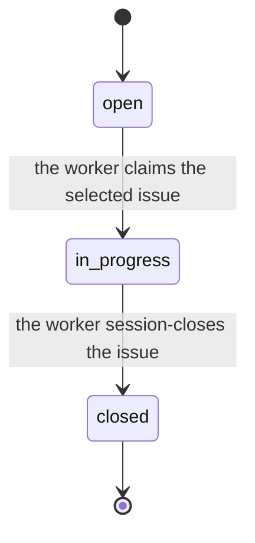

# Ortus

[](https://github.com/who/ortus/actions/workflows/test.yml)

*Ortus* (Latin: "rising, origin, birth"), the point from which something begins.

Ortus autonomously closes a backlog of bd-tracked issues using Claude Code, Codex, Grok, or a model you serve yourself, one fresh subprocess per task. Inspired by the Ralph Loop concept: fresh window per task, drive the queue to zero, no context drift.

## Install

**Requires [uv](https://docs.astral.sh/uv/getting-started/installation/) on PATH.** Ortus is distributed via PyPI and installed by uv; we don't auto-install uv.

**One-liner (recommended):**

```bash
curl -fsSL https://github.com/who/ortus/releases/latest/download/install.sh | sh
```

**Direct PyPI:**

```bash
uv tool install ortus
ortus --version
```

**From source / pinned commit:**

```bash
uv tool install git+https://github.com/who/ortus.git
# Pin a specific tag/branch:
uv tool install 'git+https://github.com/who/ortus.git@v0.1.0'
```

**Troubleshooting:**

| Symptom | Fix |
|---|---|
| `uv: command not found` | Install uv: `curl -LsSf https://astral.sh/uv/install.sh \| sh` (see [uv docs](https://docs.astral.sh/uv/getting-started/installation/)) |
| `ortus: command not found` after install | `uv tool update-shell` then open a new shell |
| `bd: command not found` | `brew install beads` (mac) or grab a release from https://github.com/gastownhall/beads/releases |

## Quick start

```bash
# Install Ortus globally; it is system-wide, not a project dependency
curl -fsSL https://github.com/who/ortus/releases/latest/download/install.sh | sh

# Bootstrap YOUR project
cd your-project
ortus init .

# Verify prereqs for the configured backend
ortus check .

# Decompose a PRD into bd issues
ortus plan . path/to/feature.md

# Or run the idea→interview→PRD→tasks flow with no PRD path
ortus plan .

# Drive the bd queue to zero, one task per fresh agent subprocess
ortus grind .

# Override the project backend for one run
ortus grind . --backend codex

# Bounded: stop after N tasks
ortus grind . --tasks 5

# Prototype bar for one run: lint and syntax checks only, no behavioral tests
ortus grind . --prototype
```

**Note:** Ortus is a global CLI you install once and use everywhere, not a Python dependency. You don't clone this repository into your project. `ortus init` only adds a small set of per-project files (`.beads/`, `.ortusrc`, `.gitignore`, managed blocks in `AGENTS.md` and `CLAUDE.md`, and the provisioned backends' config directories) to an existing directory. Host prose outside the Ortus markers in `AGENTS.md` and `CLAUDE.md` is preserved byte-for-byte, and the bundled runtime prompts are never copied into the repo.

## The verbs

| Verb | Purpose |
|---|---|
| `ortus init <repo>` | Bootstrap a fresh repo; `--backend all|claude|codex|grok|local|opencode`, where the default `all` is provisioning-only and pins a concrete run backend in `.ortusrc` |
| `ortus check <repo>` | Verify bd, the run backend, sandbox, backend config, and managed agent files; WARN rows cover provisioned siblings; strictly read-only |
| `ortus plan <repo> [<PRD>]` | Decompose a PRD into bd issues, or interview-then-PRD-then-decompose if no PRD path |
| `ortus grind <repo>` | Drive the bd queue, one task per fresh Claude, Codex, Grok, or opencode subprocess |
| `ortus interview <repo> [<feature-id>]` | Interactive PRD-building interview for an open feature |
| `ortus tail <repo>` | Follow `logs/grind-*.log` with stream-json filtering |
| `ortus human <repo>` | Render `HUMAN-TODO.md` from bd issues flagged for a human decision |
| `ortus dashboard <repo>` | Watch one grind run in a read-only live view |
| `ortus spec` | Print the readiness schema issue-authoring contract |
| `ortus validate <repo> [<id>...]` | Report whether bd issues satisfy readiness schema v1 before grinding; no id sweeps every open issue; exit 1 when any is unready |
| `ortus ingest <repo> --packet <dir>` | File one readiness schema v1 issue from a packet directory (or `--stdin` JSON); validates before it writes, so an unready packet creates nothing |
| `ortus prompt` | `list`, `show`, or `eject` the bundled runtime prompts (see Runtime prompts) |
| `ortus unlock <repo>` | Clear a stuck grind flock; optionally revert in-progress claims |

Run `ortus <verb> --help` for flags. Run `ortus --version` for the installed version.

### Supported platforms

| Platform | Status | Notes |
|---|---|---|
| Linux (Ubuntu/WSL2) | full | requires `bubblewrap` for `ortus grind` |
| macOS | full | Seatbelt (`sandbox-exec`) is built-in |

**Windows is not supported** (decision 2026-05-17). Windows users should run ortus inside **WSL2** (Windows Subsystem for Linux), where ortus runs as a normal Linux process.

## Prerequisites

| Tool | Why | Install |
|---|---|---|
| **uv** | install + run ortus | [docs.astral.sh/uv](https://docs.astral.sh/uv/getting-started/installation/) |
| **bd** (beads) v1.0.0+ | issue tracking (Dolt-backed) | `brew install beads` or [GH release](https://github.com/gastownhall/beads/releases) |
| **claude**, **codex**, or **grok** | agent running inside `ortus grind`; Claude is the default | [Claude Code](https://github.com/anthropics/claude-code) / [Codex CLI](https://github.com/openai/codex) / Grok Build |
| **opencode** (`local` is its older name) | any OpenAI-compatible server exposing /v1/models and /v1/chat/completions, driven through the opencode CLI, which also runs the CodeGraph MCP server itself | [opencode](https://opencode.ai) + [llama.cpp llama-server](https://github.com/ggml-org/llama.cpp) |
| **jq** | bd JSON post-processing | `brew install jq` / `apt install jq` |
| **bwrap** (Linux) or **sandbox-exec** (Mac) | OS-level sandbox for `ortus grind` | `apt install bubblewrap` / built into macOS |

Required: **[CodeGraph](https://github.com/colbymchenry/codegraph)**. `ortus init` installs the index and pins `codegraph = "required"`, `ortus check` reports it as a prerequisite, and `plan`/`grind` abort before launching an agent when it is missing. Ortus probes the project index and CLI, then reconciles those outer signals with CodeGraph MCP calls observed in each agent phase. It never assumes that an index alone means the agent can use the tools. For a repository CodeGraph cannot index, bootstrap without it using `ortus init --codegraph off`.

## Agent backends

Claude remains the default run backend. `ortus init` defaults to `--backend all`, which is provisioning-only. It writes every backend's config directory and pins `backend = "claude"` in `.ortusrc`. Pass a concrete `ortus init . --backend codex`, `--backend grok`, or `--backend opencode --local-model <id>` to provision and pin that backend instead. The pinned value is always concrete, and `backend = "all"` is rejected at run time as an init provisioning option, not a run backend. Per run, override with `--backend` or `ORTUS_BACKEND`. Precedence is command-line flag, environment, `.ortusrc`, then the Claude default. `opencode` has no config directory of its own. Its provisioning is the `[local]` table in `.ortusrc` plus the provider and MCP entries init merges into the project's `opencode.json`. `--backend all` cannot write that file, because it needs the served model, so it leaves `[local]` as a commented reference block and `opencode.json` untouched until a pinned init names the model. `local` is the older name of the same backend and still loads.

Regardless of `--backend`, init writes managed blocks into `AGENTS.md` (`block=agents`) and `CLAUDE.md` (`block=pointer`), fenced by `<!-- BEGIN ortus ... -->` / `<!-- END ortus ... -->` markers. Re-running init is safe. Host prose outside the markers is preserved byte-for-byte, a block written by a newer Ortus is left untouched, and `AGENTS.override.md` is never written. `ortus check` is two-tier. A missing, malformed, drifted, or gitignored agent-file block is an error the operator fixes with `ortus init --force`. A sibling backend that is provisioned but not the run backend earns an informational row, so "provisioned but not runnable" gaps render as WARN and never fail the check, because the exit code belongs to the run backend.

Claude and Grok workers run a narrow `/goal` session (`claude -p '/goal …'` or `grok -p`; Grok is headless, not a TUI). The landed Q1 finding is EXPANDS, so Ortus wraps the Grok task in `/goal` the same way as Claude. Codex and opencode workers run the same logical single-issue task as a **plain** prompt, `codex exec '…'` or `opencode run '…'`. Codex slash commands belong to its interactive UI and opencode has none; Ortus never passes a literal `/goal` to either.

`opencode` is [opencode](https://opencode.ai) pointed at a server you run. The worker is `opencode run --format json -m ortuslocal/<model> '…'`, over the OpenAI chat-completions API. CodeGraph needs no shim, because opencode runs the MCP server registered in `opencode.json` itself and hands the model each tool as an ordinary function. Swapping models is a config change, never a code change. See *Serving a local model* for setup, the serving command, and the read-only verify posture.

The worker implements the issue, runs its acceptance checks, and session-closes. It commits the paths it owns, `bd close`s the issue, `bd dolt push`es, and `git push`es. `ortus grind` selects the work, launches one fresh process, and trusts only observable bd and git state. It reaps the worker once a new issue is closed and HEAD is in sync with origin.

Any backend can start from a dirty checkout. The fresh worker receives the
selected issue and the current Git state, judges which changes are useful, and
continues rather than demanding a clean tree. Changes it judges unrelated to
the issue stay out of its owned paths, and grind leaves them in the worktree,
never reset, stashed, deleted, or committed. If a worker exits nonzero or fails
verification, the issue and its context are recorded under `logs/`, and the
next run prefers that same issue. A claim left unfinished is leftover
`in_progress`, not an orphan, and the next grind continues it.

### Serving a local model

**What this backend assumes.** The rest of this section takes these as given:

- **You run the model; Ortus drives it.** A GGUF is not an agent. It can't run tools on its own, so Ortus points the [opencode](https://opencode.ai) CLI at a server you host. opencode drives the worker (`opencode run`), the same as the Claude and Codex backends drive their CLIs. Ortus never starts, stops, or manages the model server. That part is yours.
- **The wire is the OpenAI chat-completions API.** The server answers `GET /v1/models` and executes function calls on `POST /v1/chat/completions`. llama.cpp's `llama-server` does. The backend is verified against opencode 1.18.27 driving `llama-server`.
- **The default endpoint is `http://127.0.0.1:8080/v1`.** That is llama-server on localhost. A different port or a remote host is one config value (see *A different port, host, or a keyed server* below).
- **The reference model in these docs is `unsloth/Qwen3.8-27B-GGUF:Q4_K_M`.** It is a stock Qwen3-27B build. The backend does not care which model you serve. We ran more than one Qwen3-27B GGUF through it with no code change, and swapping models touches only config. Prefer a text-only build for coding work.
- **CodeGraph runs as an opencode MCP server, client-side.** opencode launches `codegraph serve --mcp` itself and hands the model each tool as an ordinary function, so nothing sits between the worker and the server.
- **Two postures.** An implement worker runs with every tool auto-approved and nothing wrapping the process, so run it on a host you are willing to let it write to. A verify worker runs read-only, with the `bash`, `edit`, and `write` tools removed (see *Posture* below).

`opencode` needs a server that speaks the OpenAI chat-completions API:
`GET /v1/models` must list the model and `POST /v1/chat/completions` must
execute function calls. llama.cpp's `llama-server` does. The backend was
verified against opencode 1.18.27 driving llama-server. The
reference command, the same one `ortus check --backend opencode` prints as the
remediation when a probe fails:

```bash
llama-server -hf unsloth/Qwen3.8-27B-GGUF:Q4_K_M --jinja --ctx-size 32768 --flash-attn on --host 127.0.0.1 --port 8080
```

Add `--cache-type-k q8_0 --cache-type-v q8_0` to halve the memory the 32k
KV cache takes. Prefer a text-only GGUF for coding work, since a multimodal
build spends VRAM on a vision tower the worker never uses. `--jinja` is
required for tool calling. Without it the model narrates the call as text instead of making
it. No check row proves tool calling; the worker's own CodeGraph handshake
does, on the wire opencode actually uses, so a server started without `--jinja`
shows up as a worker that never makes its first tool call and is stopped at
the handshake gate. The context size is a floor, not a suggestion. A worker
prompt plus CodeGraph tool output does not fit a smaller window, and
`ortus check` warns when the server reports less than 32768.

`model` must be the id `GET /v1/models` reports. For llama-server that is the
model path (`unsloth/Qwen3.8-27B-GGUF:Q4_K_M` above) or a `--alias` you pass.
Then pin and verify:

```bash
ortus init . --backend opencode --local-model unsloth/Qwen3.8-27B-GGUF:Q4_K_M
ortus check . --backend opencode
```

Run `ortus init --backend opencode` with no `--local-model` at a terminal and
it lists what the server serves and lets you pick one by number; piped or in a
script it prints the list and exits, so pass `--local-model` there.

**A different port, host, or a keyed server.** The endpoint is one value. The
default is `http://127.0.0.1:8080/v1`. Override it at init with
`--local-base-url`, or by hand in the `[local]` table's `base_url`:

```bash
# a different local port
ortus init . --backend opencode --local-base-url http://127.0.0.1:9000/v1 --local-model unsloth/Qwen3.8-27B-GGUF:Q4_K_M
# a model served on another machine on your network
ortus init . --backend opencode --local-base-url http://gpubox.lan:8080/v1 --local-model unsloth/Qwen3.8-27B-GGUF:Q4_K_M
```

For a server behind an API key, set `api_key_env` in `[local]` to the *name* of
an environment variable, never the key itself. opencode reads that variable at
launch, and Ortus writes only the reference `"apiKey": "{env:NAME}"` into
`opencode.json`. A grind worker reaches the server over that `base_url`, so a
remote host has to be reachable from wherever grind runs, and a non-loopback
host should be one you trust with the worker's traffic.

Init writes the `[local]` table into `.ortusrc` and merges two Ortus-owned
entries into the project's `opencode.json`, creating the file when it is
absent:

```json
{
  "$schema": "https://opencode.ai/config.json",
  "provider": {
    "ortuslocal": {
      "npm": "@ai-sdk/openai-compatible",
      "name": "Ortus local model",
      "options": { "baseURL": "http://127.0.0.1:8080/v1" },
      "models": { "unsloth/Qwen3.8-27B-GGUF:Q4_K_M": {} }
    }
  },
  "mcp": {
    "codegraph": {
      "type": "local",
      "command": ["codegraph", "serve", "--mcp"],
      "enabled": true
    }
  }
}
```

The provider entry is the keyless shape a llama-server accepts. When `[local]`
sets `api_key_env`, the entry gains `"apiKey": "{env:NAME}"`, opencode's own
reference that it substitutes at startup, so the key itself never enters the
file. The `mcp.codegraph` entry is the whole CodeGraph registration for this
backend. opencode launches the server from it and runs every call
client-side, so there is no shim and no per-launch override, and under
`codegraph = "off"` init leaves the `mcp` table alone. The merge is keyed.
Re-running init rewrites exactly those two entries when they have drifted,
keeps every other provider, server, and key in the file in its original
order, writes nothing when both are already current, and refuses a file that
is not a JSON object before anything else is touched.

`ortus check --backend opencode` prints the `opencode` binary row, the
`opencode.json` row, and six rows after them. The binary row looks on PATH
and then in `~/.opencode/bin`, where the opencode installer puts the
executable and a non-login shell's PATH does not reach; the worker is
launched by that same resolved absolute path, so a green row is a launchable
worker, and a miss names both fixes: add the directory to PATH, or install
opencode. `[local]` validates the table
and, when `api_key_env` is set, that the variable is exported; the row shows
the variable's name and never its value. `opencode provider` compares the
`ortuslocal` entry with the table fact by fact, checking `baseURL`, the served
model among `models`, and the key reference, then names the re-init that
repairs a drift, so a model option you added by hand survives. `opencode endpoint`
requests `/v1/models` and fails if the server is down, demands a key, or does
not list `model`. `opencode mcp` requires an enabled `codegraph` entry in the
`mcp` table and prints the exact JSON to add when it is missing.
`opencode posture` resolves the `permission` table with `OPENCODE_PERMISSION`
from your shell merged over it, the way opencode does at startup, and fails
when `edit`, `write`, or `bash` would be anything but `allow` for an implement
worker, because a denial exported in the shell would quietly cripple every
implement run; the same row reports the verify denial. `opencode context`
reads `n_ctx` from llama-server's `/props` and is informational. It warns
below 32768 and never fails the check. No row launches opencode.
`ortus grind` repeats the binary resolution and the endpoint probe at startup,
before it takes the lock or launches a worker, so a missing install or a
server that has gone away fails fast with the same remediation and no issue
is claimed, and its CodeGraph probe treats a missing or disabled
`mcp.codegraph` entry as CodeGraph unavailable, which under `required` stops
the run before any issue is claimed.

**Posture.** opencode has no OS sandbox of its own, and its permissions are
per tool, not per file. An implement worker runs `opencode run` headless with
every tool auto-approved and nothing wrapping the process; the OS sandbox
`ortus grind` requires still gates the launch but does not enclose this
worker, so run an unattended local model on a host you are willing to let it
write to. The verify posture is the tool-level denial the runner exports per
launch as `OPENCODE_PERMISSION={"bash": "deny", "edit": "deny", "write": "deny"}`.
opencode drops those three tools from the model's toolset entirely, bash
included, which is the one tool a permission table cannot otherwise contain
because an allowed bash writes through a redirect. A verifier therefore holds
nothing that can touch the tree and needs no read-only root on top. The same
denial is exported once more at agent scope, as
`OPENCODE_CONFIG_CONTENT={"agent": {"build": {"permission": ...}}}` merged
over any document already in that variable, because opencode resolves
permissions as an ordered ruleset in which agent-scoped rows follow the
global ones and the last match wins, so an `agent.build.permission` allow in
the project or user config would otherwise hand the write tools back to the
verifier. A value in that variable that is not a JSON object is refused
before launch rather than replaced. Denied tools simply never appear in the
session; the log records no denial event.

**Wall clock.** Local decode is slower than a hosted model, and a worker runs
the work spec's checks inside its window. Raise `--worker-timeout` above the
5400s default for a large model, for example
`ortus grind . --backend opencode --worker-timeout 10800`; the default is
unchanged for the other backends.

**What to expect.** A 27B-class local model can drive the whole loop. We ran
more than one Qwen3-27B GGUF through the backend, config swap only, no code
change. In each run, on llama-server driven by opencode, the worker claimed a
fresh hello-world issue, implemented it with bash/write/read and CodeGraph
queries (no grep fallback), verified under the read-only denial, and closed it
with a working commit, unaided. The model's own turn loop carries each phase,
not `/goal`, and a large context window (`--ctx-size 131072` on the serving
side) holds the worker's context across its tool calls. Two practical notes.
Prefer a text-only GGUF, since a multimodal build spends VRAM on a vision tower
the worker never uses. And expect minutes per phase. A small local model here
is slow but correct, so size `--worker-timeout` for the model, not the task.

## Why ortus

- **One install, all projects.** `uv tool install ortus` once; every repo uses the same canonical tooling. No per-repo vendor copies to chase.
- **`bd ready` IS the queue.** No README task lists, no TodoWrite scratchpads. The queue is data.
- **The scheduler is the loop.** Backend output is advisory; observable bd state decides whether an iteration succeeded, orphaned a claim, or made no change.
- **Sandboxed by default.** `ortus grind` refuses to launch unless bwrap/Seatbelt is available; Codex workers retain `workspace-write`, Claude uses its generated sandbox policy, Grok uses its native `--sandbox workspace` (not wrapped in bwrap), and opencode workers implement under opencode's headless auto-approval and verify under a per-launch permission denial that removes the edit, write, and bash tools (see Serving a local model).

## Configuration

The optional pre-turn Jev gate is disabled by default. See the
[single-seat judge pilot](docs/judge.md) for configuration, privacy, failure
policy and rollback instructions.

Optional `<repo>/.ortusrc` (TOML) overrides `~/.ortusrc`:

```toml
prefix = "myproj"       # bd issue-id prefix
project_type = "python" # python | typescript | go | rust | polyglot
backend = "claude"      # claude | codex | grok | opencode (older name: local); always concrete, "all" is init-only and invalid here
codegraph = "required"  # off | auto | required (default: required)
codegraph_refresh_blocking = false
verification = "full"   # full | prototype (default: full)
merge_gate = false      # wait for issue-branch checks before fast-forward
merge_gate_timeout = 1800  # seconds; timeout blocks, never lands

[profiles.claude.plan]
model = "opus"
reasoning_effort = "high"

[profiles.claude.implement]
model = "sonnet"

[profiles.claude.verify]
model = "opus"
reasoning_effort = "high"

[profiles.claude.finalize]
model = "haiku"

[profiles.codex.implement]
model = "gpt-5.2-codex"
reasoning_effort = "high"

[profiles.opencode.implement]
reasoning_effort = "medium"  # forwarded as `opencode run --variant`; the served model is [local].model, a model here overrides it

# Read under backend = "opencode" (or its older name local). Last in the file:
# TOML keeps every key below a [table] header inside that table.
[local]
base_url = "http://127.0.0.1:8080/v1"  # the server you run; default is llama-server on localhost
model = "unsloth/Qwen3.8-27B-GGUF:Q4_K_M"  # the id GET {base_url}/models reports (llama-server model path or --alias)
# api_key_env = "LLAMA_API_KEY"        # the NAME of a variable holding a bearer key, never the key itself
```

Profiles are independent for `plan`, `implement`, `verify`, and `finalize`, and
are scoped to the selected backend. `finalize` is the one bounded, read-only
pass that writes the commit message from the verified diff; it is prose over
material it is handed rather than correctness reasoning, so Claude defaults it
to `haiku` and any failure falls back to the deterministic commit body. Resolution is CLI phase override, then the matching
project table, then the matching user table, then the provider default. Nested
tables merge field by field, so a project can override only `model` while
inheriting `reasoning_effort` from `~/.ortusrc`. Omitted fields add no backend
CLI flags. Under `opencode` (or `local`) the served model comes from `[local].model`, a
profile `model` overrides it for that phase only, and `reasoning_effort` is
forwarded as `opencode run --variant`, a named variant of the model (`none`
through `xhigh`, plus `high` and `max`) that is a no-op for a name the served
model does not define. `ortus plan` accepts `--model` and `--reasoning-effort`; `ortus grind`
accepts `--implement-model`, `--implement-reasoning-effort`, `--verify-model`,
and `--verify-reasoning-effort`. The compatibility `--fast` flag applies only
to Claude implementation workers and never to verification.

`verification` is the bar a grind worker must clear before it session-closes
an issue. `full`, the default, runs the issue's criterion-check commands.
`prototype` runs only the project's linter (`ruff`, `eslint`, `golangci-lint`,
or `cargo clippy`) plus a syntax or compile gate chosen from `project_type`
(`python -m compileall`, `tsc --noEmit`, `go build ./...`, or `cargo check`; a
`polyglot` project gets the gate of every language whose marker file sits at
the repository root) and deliberately skips the issue's behavioral test
commands and the repo test suite. The acceptance criteria stay in the work
spec as the record; prototype mode does not run them. `ortus grind --prototype`
selects the mode for one run and wins over the `.ortusrc` pin, which wins over
the default. The grind start line records the resolved mode and where it came
from, and `ortus check` reports it before a run. Prototype mode is a lowered
bar for throwaway or exploratory work on high-velocity prototype projects, not
a faster full verification. An issue closes on a clean lint pass with its
behavior unproven.

### Implementation readiness

`ortus plan` writes executable tasks using readiness schema v1 in the existing
Beads description, design, and acceptance-criteria fields. Tasks must state
their objective and behavioral context; scope and non-goals; concrete files and
symbols; resolved decisions and compatibility constraints; ordered steps,
dependencies, edge cases, and planning-gap handling; and AC-numbered observable
criteria mapped one-to-one to exact checks plus targeted tests. Epics are
containers and are exempt.

After decomposition, `ortus plan` validates every new task mechanically. It may
run one fresh repair subprocess with the resolved planning profile, updating
only the named issues in place. A repair that creates replacement issues, or
leaves any work spec incomplete, makes planning exit nonzero before work is
claimed.

`ortus grind` applies the same guard immediately before claim. Unready legacy or
manually authored tasks remain open, and their exact missing sections are
printed and written to the grind log for planning or human repair; grind may
continue to a later ready task. If implementation discovers a repository
contradiction or unresolved material choice, the worker records a `PLAN-GAP`
comment, preserves owned-path edits, flags the issue for human handling, and
stops without committing or closing it.

### How a grind iteration finishes

Each iteration is one fresh worker on one issue. The worker implements the
packet, runs the issue's acceptance checks, and session-closes. It commits
only the paths it owns, closes the issue, and pushes. Grind does not close,
commit, or push on the worker's behalf.

Grind watches observable state. When the closed-issue count has grown since
spawn and HEAD is in sync with origin, it reaps the worker and starts the
next ready issue. A worker that exits without closing leaves the claim
`in_progress`; grind does not treat that as success.

`--tasks N` still bounds how many issues one invocation will drive. An issue
the worker cannot finish stays open or `in_progress` for the next run or for
a human. A finding that names an unresolved product or architecture decision
is a planning gap. The worker records `PLAN-GAP`, leaves the claim, and does
not invent an answer.

### State graphs

A bd issue's status outlives any single grind run. The diagram below is
how that status moves under `/goal` grind. The worker claims, session-closes,
or leaves the claim `in_progress` for the next window or a human. It is
generated from `src/ortus/core/lifecycle.py`; changing a status without
regenerating it fails the test suite.

<!-- BEGIN GENERATED: state-graph -->
<!-- Generated from src/ortus/core/lifecycle.py. Do not edit by hand: tests/test_state_graph_docs.py fails and prints the correct block. -->

#### bd issue status

The statuses Ortus reads and writes through `bd`. A worker claims an open issue, session-closes it, or leaves the claim in_progress for the next window or a human. Leftover in_progress is not reverted to open.



<details><summary>Every issue transition (4)</summary>

| From | Trigger | To |
| --- | --- | --- |
| `open` | the worker claims the selected issue | `in_progress` |
| `in_progress` | the leftover claim continues in the next window | `in_progress` |
| `in_progress` | grind labels human and stops | `in_progress` |
| `in_progress` | the worker session-closes the issue | `closed` |

</details>
<!-- END GENERATED: state-graph -->

### CodeGraph lifecycle

`required` is the default. It fails before agent launch when `.codegraph/` or
the `codegraph` CLI is missing, fails when a phase transcript contains no
CodeGraph MCP capability handshake, and blocks verification if the post-edit
`codegraph sync` fails. `auto` stays selectable for a best-effort posture. Planning and each grind
issue transaction emit a clear activation or fallback decision, and missing or
unhealthy CodeGraph falls back to grep/Read. `off`
performs no CodeGraph calls and reports that it is disabled. It is the escape
hatch for a repository CodeGraph cannot index.

`ortus init` builds the index, writes the resolved policy into `.ortusrc`, and
gitignores `.codegraph/` (the index is local, machine-specific, and often
large). Because it is gitignored, a fresh clone has no index, so run
`codegraph init` once, which `ortus check` names as the remediation. Register
the CodeGraph MCP server for the selected Claude, Codex, Grok, or opencode backend; for
opencode that registration is the `mcp.codegraph` entry init merges into
`opencode.json`, which the probe reads before any claim. Planning
validates work specs,
implementation confirms references and runs impact analysis, the parent refreshes
the index after owned-path edits, and a fresh verifier independently checks changed
symbols and callers.

```text
[2026-08-08 13:28:45] CodeGraph probe (mode=required)
error: CodeGraph required but unavailable: project index .codegraph/ is missing.
```

Logs retain bounded `ortus.codegraph` JSON records rendered by `ortus tail` as
`[CODEGRAPH]` lines. Plan-created issues and verifier comments retain a
`CodeGraph engagement v1` block with availability, freshness, tool/query totals,
reviewed symbols, impacted and out-of-scope callers, misses, fallbacks, and caps.
Full query payloads and source text are excluded.

**Troubleshooting.** A missing index means run `codegraph init` and `codegraph sync`.
A missing CLI means install it. A missing handshake means the selected backend
has not registered the CodeGraph MCP server. Auto mode records the fallback and
continues. Required mode stops with an actionable diagnostic.

**Migrating an existing project.** A repo whose `.ortusrc` has no `codegraph`
key now inherits `required` and will stop at the probe until CodeGraph is in
place. Run `ortus check` to see which prerequisite is missing, then either
install the CLI and run `codegraph init`, or pin the previous behavior
explicitly with `codegraph = "auto"` (or `codegraph = "off"`) in `.ortusrc`.
Projects that already pin an explicit value are unaffected.

## Runtime prompts

The prompts that drive agent phases (`goal`, `interview`, `plan`) ship inside the CLI. `ortus init` never copies them into your repo, and the generated `AGENTS.md` does not point at them. The `prompt` verb is how you read and override them:

```bash
ortus prompt list [<repo>]          # each prompt: name, winning source, phase, description
ortus prompt show <name> [<repo>]   # resolved text on stdout; header on stderr
ortus prompt show <name> --origin   # print only where the prompt resolves from
ortus prompt eject <name> <repo>    # copy the bundled default to <repo>/.ortus/prompts/
ortus prompt eject <name> --user    # ... or to ~/.ortus/prompts/
```

Resolution is first-hit-wins across three layers:

| Layer | Path |
|---|---|
| repo override | `<repo>/.ortus/prompts/<name>.md` |
| user override | `~/.ortus/prompts/<name>.md` |
| bundled default | installed with the CLI |

`show` keeps stdout pipe-clean, so `ortus prompt show goal` can feed another
process directly. `eject` copies the bundled default, never a currently winning
override, under a provenance stamp. It requires an explicit destination (a repo
argument or `--user`; there is no cwd default) and refuses to overwrite an
existing override unless you pass `--force`. There is no `eject --all`; eject
the one prompt you intend to own. `ortus check` reports overrides
informationally. It warns when an override has no provenance stamp, when its
stamp shows the bundled default has moved since the eject, or when a file in
`.ortus/prompts/` is not a bundled prompt filename and is never loaded. An
override never fails the check.

## Glossary

Ortus's vocabulary is small and made of standard software-engineering terms
carrying one specific sense. A work spec is authored issue content, not a
message on a queue. A session-close is the worker's own commit, close, and push
at the end of one issue. These words appear in log lines, prompt contracts, and
error messages, so guessing at one misreads the run. The table below is
generated from the declaration in `src/ortus/core/glossary.py`; changing a term
without regenerating it fails the test suite.

<!-- BEGIN GENERATED: glossary -->
<!-- Generated from src/ortus/core/glossary.py. Do not edit by hand: tests/test_glossary_docs.py fails and prints the correct block. -->

| Term | What it means | On a team without agents | Analogy | Where it lives |
| --- | --- | --- | --- | --- |
| **orphan** | An issue left claimed but unclosed by a worker that ended without finishing, which the configured orphan policy then releases or keeps. | A ticket left In Progress by someone who went on holiday without updating the board. | A library book still on loan to someone who has left town and is not coming back for it. | `src/ortus/core/grind_loop.py` |
| **planning gap** | A defect in the work spec that no amount of implementing can resolve, which routes back to planning instead of shipping the issue. | A developer handing a ticket back to the analyst because it cannot be built as written. | A builder downing tools because the blueprint gives no dimension for a wall. No amount of building resolves it. | `plan_gap_guidance` in `src/ortus/core/readiness.py` |
| **readiness** | The schema an issue must satisfy before an implementation worker may be launched at it, checked mechanically when the issue is planned. | Definition of Ready: the checklist a story passes before planning will let anyone start it. | The pre-flight checklist an aircraft passes before pushback, not an opinion about whether it looks ready. | `validate_issue()` in `src/ortus/core/readiness.py` |
| **session-close** | The worker's own commit, bd close, bd dolt push and git push at the end of one issue, after which grind reaps. | The developer closing their own ticket after the checks they ran, not a release manager doing it for them. | The couple signing their own register. The registrar is not in the room. | `src/ortus/prompts/goal-prompt.md` step 4 |
| **task** | A non-epic bd issue small and complete enough for one implementation worker to execute end to end, which is what readiness validates. | A story an engineer can finish in one sitting, as opposed to an epic that has to be broken down first. | An errand you can finish on one trip, rather than a house move that has to be broken into trips first. | `src/ortus/core/readiness.py` |
| **work spec** | The authored bd issue content (description, design, acceptance criteria, notes) that a worker treats as authoritative, not any message on a queue. | The ticket as the analyst wrote it: the spec of record a developer builds from and argues with, not a chat message. | The blueprint handed to the builder. What is on the paper governs, not what anyone remembers saying. | `src/ortus/core/readiness.py` |
| **worker** | One agent subprocess that implements one issue end to end, including its acceptance checks and session-close, started fresh with no memory of any worker before it. | A contractor hired for exactly one ticket, who has never seen the codebase before and will not be back. | A temp who works exactly one shift, has never seen the building before, and will not be back tomorrow. | `compose_worker_prompt()` in `src/ortus/core/agent.py` |
<!-- END GENERATED: glossary -->

## Session-close protocol

When ending a work session, push your work:

```bash
bd close <id> --reason "..."
git add <owned-paths> && git commit -m "..."
bd dolt push
git push
```

Commit only the paths you own, never `git add -A`. Work is not done until pushed. The generated `AGENTS.md` repeats this in every project, inside its managed Ortus block.

## Development

```bash
# Local install
uv sync --all-extras

# Tests
uv run pytest -m fast -n auto --test-timeout=30
uv run pytest -m integration -n auto --test-timeout=60
```

See [the test-gate guide](docs/testing.md) for changed-path selection,
verifier expansion, CI timing evidence, and tagged network/live-provider
release smoke.

## License

MIT
