# Authoring work

Work reaches the queue two ways: a PRD decomposed by `ortus plan`, or a single
packet filed by `ortus ingest`. Both land as bd issues that satisfy readiness
schema v1, because [grind](grind.md) refuses to claim anything that does not.

```mermaid
flowchart TD
    prd["PRD file"] --> plan["ortus plan"]
    idea["freeform idea"] --> interview["ortus interview"] --> prd
    plan --> validated{"readiness schema v1"}
    validated -->|complete| beads["bd issues"]
    validated -->|incomplete| repair["one fresh repair pass"] --> recheck{"readiness schema v1"}
    recheck -->|complete| beads
    recheck -->|still incomplete| fail["exit nonzero, nothing claimed"]
    packet["packet directory"] --> ingest["ortus ingest"]
    stdin["stdin JSON"] --> ingest
    ingest --> gate{"readiness schema v1"}
    gate -->|complete| created["bd create"]
    gate -->|incomplete| rejected["rejected, nothing created"]
    beads --> sweep["ortus validate"]
    created --> sweep
```

## `ortus plan`

`ortus plan <repo> <PRD>` decomposes a PRD into bd issues. With no PRD path it
runs the idea-to-interview-to-PRD-to-tasks flow first, so a project with nothing
written down still has an entry point. Decomposition uses the resolved planning
profile; see [configuration](configuration.md).

Planning validates everything it wrote before it exits. It may run one fresh
repair subprocess that updates only the named issues in place. A repair that
creates replacement issues, or leaves any work spec incomplete, makes planning
exit nonzero before any work is claimed.

## `ortus interview`

`ortus interview <repo> [<feature-id>]` is the interactive half: it builds a PRD
by asking, one feature at a time. It is exempt from the per-phase progress-line
convention because the operator's typing provides the rhythm. The label
vocabulary it moves a feature through is documented in
[the label state machine](labels.md).

## `ortus ingest`

`ortus ingest <repo> --packet <dir>` files exactly one readiness schema v1 issue
from a packet directory; `--stdin` reads the same packet as JSON. It validates
before it writes, so an unready packet creates nothing and the caller fixes the
packet rather than an issue already in the tracker. This is the filing path for
agents, in place of a multiline `bd create`.

## `ortus validate`

`ortus validate <repo> [<id>...]` reports whether bd issues satisfy readiness
schema v1 before grinding. With no id it sweeps every open issue. It exits 1
when any issue is unready, which makes it usable as a gate in CI or a pre-grind
hook.

## `ortus spec`

`ortus spec` prints the readiness schema issue-authoring contract itself: the
sections a work spec owes and what each one is for. It reads nothing and writes
nothing, so it is the cheapest way to answer "what does a ready issue look
like" — including for an agent about to file one.
