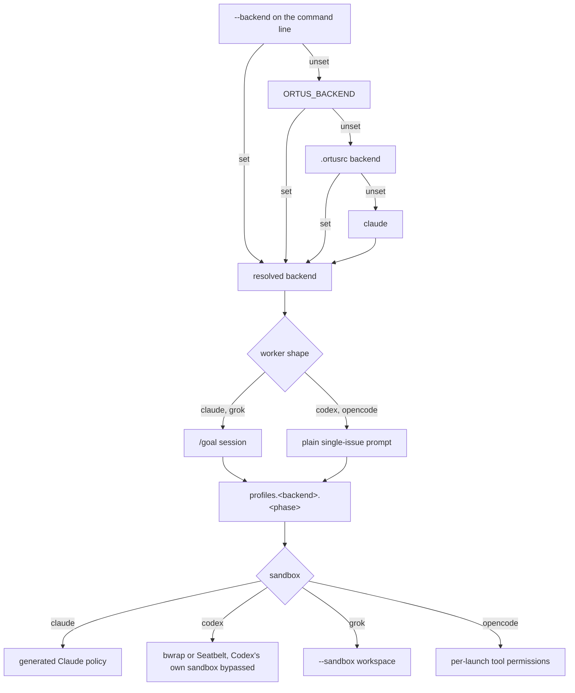

# Agent backends

One Ortus, four agent CLIs. `ortus grind` is backend-neutral: it selects the
work, launches one fresh worker, and reads observable bd and git state. Which
CLI that worker is, and what shape its prompt takes, is what this page settles.

## How a backend is chosen

Claude remains the default run backend. Precedence is the command-line flag,
then the environment, then `.ortusrc`, then Claude.

`ortus init` defaults to `--backend all`, which is provisioning-only. It writes
every backend's config directory and pins `backend = "claude"` in `.ortusrc`.
Pass a concrete `ortus init . --backend codex`, `--backend grok`, or
`--backend opencode --local-model <id>` to provision and pin that backend
instead. The pinned value is always concrete, and `backend = "all"` is rejected
at run time as an init provisioning option, not a run backend.

`opencode` has no config directory of its own. Its provisioning is the `[local]`
table in `.ortusrc` plus the provider and MCP entries init merges into the
project's `opencode.json`. `--backend all` cannot write that file, because it
needs the served model, so it leaves `[local]` as a commented reference block
and `opencode.json` untouched until a pinned init names the model. `local` is
the older name of the same backend and still loads.

## Managed agent files

Regardless of `--backend`, init writes managed blocks into `AGENTS.md`
(`block=agents`) and `CLAUDE.md` (`block=pointer`), fenced by
`<!-- BEGIN ortus ... -->` / `<!-- END ortus ... -->` markers. Re-running init
is safe. Host prose outside the markers is preserved byte-for-byte, a block
written by a newer Ortus is left untouched, and `AGENTS.override.md` is never
written.

`ortus check` is two-tier. A missing, malformed, drifted, or gitignored
agent-file block is an error the operator fixes with `ortus init --force`. A
sibling backend that is provisioned but not the run backend earns an
informational row, so "provisioned but not runnable" gaps render as WARN and
never fail the check, because the exit code belongs to the run backend.

## Worker shape per backend

Claude and Grok workers run a narrow `/goal` session (`claude -p '/goal …'` or
`grok -p`; Grok is headless, not a TUI). The landed Q1 finding is EXPANDS, so
Ortus wraps the Grok task in `/goal` the same way as Claude. Codex and opencode
workers run the same logical single-issue task as a **plain** prompt,
`codex exec '…'` or `opencode run '…'`. Codex slash commands belong to its
interactive UI and opencode has none; Ortus never passes a literal `/goal` to
either.

`opencode` is [opencode](https://opencode.ai) pointed at a server you run. The
worker is `opencode run --format json -m ortuslocal/<model> '…'`, over the
OpenAI chat-completions API. CodeGraph needs no shim, because opencode runs the
MCP server registered in `opencode.json` itself and hands the model each tool
as an ordinary function. Swapping models is a config change, never a code
change. See [serving a local model](local-model.md) for setup, the serving
command, and the read-only verify posture.

## Sandbox per backend

`ortus grind` refuses to launch unless bwrap or Seatbelt is available. Codex
workers bypass Codex's own sandbox so they can run the nested processes their
checks need and verify read-only, Claude uses its generated sandbox policy,
Grok uses its native `--sandbox workspace` and is not wrapped in bwrap, and
opencode workers implement under opencode's headless auto-approval and verify
under a per-launch permission denial that removes the edit, write, and bash
tools.

## What every worker does

The worker implements the issue, runs its acceptance checks, and session-closes.
It commits the paths it owns, `bd close`s the issue, `bd dolt push`es, and
`git push`es. `ortus grind` reaps it once a new issue is closed and HEAD is in
sync with origin. See [how a grind iteration finishes](grind.md) for the
scheduler's half of that contract.

## Starting from a dirty checkout

Any backend can start from a dirty checkout. The fresh worker receives the
selected issue and the current Git state, judges which changes are useful, and
continues rather than demanding a clean tree. Changes it judges unrelated to
the issue stay out of its owned paths, and grind leaves them in the worktree,
never reset, stashed, deleted, or committed. If a worker exits nonzero or fails
verification, the issue and its context are recorded under `logs/`, and the
next run prefers that same issue. A claim left unfinished is leftover
`in_progress`, not an orphan, and the next grind continues it.
