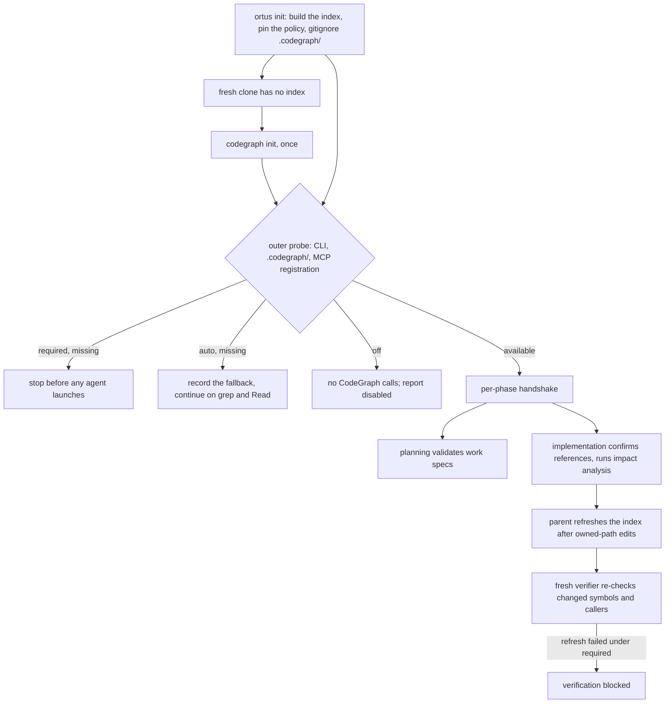

# CodeGraph lifecycle

[CodeGraph](https://github.com/colbymchenry/codegraph) is a prerequisite of an
Ortus project, not an enhancement. The policy lives in `.ortusrc` and is
injected into every agent phase as that phase's CodeGraph contract.



## The three policies

`required` is the default. It fails before agent launch when `.codegraph/` or
the `codegraph` CLI is missing, fails when a phase transcript contains no
CodeGraph MCP capability handshake, and blocks verification if the post-edit
`codegraph sync` fails. `auto` stays selectable for a best-effort posture.
Planning and each grind issue transaction emit a clear activation or fallback
decision, and missing or unhealthy CodeGraph falls back to grep/Read. `off`
performs no CodeGraph calls and reports that it is disabled. It is the escape
hatch for a repository CodeGraph cannot index.

## Where the index comes from

`ortus init` builds the index, writes the resolved policy into `.ortusrc`, and
gitignores `.codegraph/` (the index is local, machine-specific, and often
large). Because it is gitignored, a fresh clone has no index, so run
`codegraph init` once, which `ortus check` names as the remediation. Register
the CodeGraph MCP server for the selected Claude, Codex, Grok, or opencode
backend; for opencode that registration is the `mcp.codegraph` entry init merges
into `opencode.json`, which the probe reads before any claim.

Ortus probes the project index and CLI, then reconciles those outer signals with
CodeGraph MCP calls observed in each agent phase. It never assumes that an index
alone means the agent can use the tools.

```text
[2026-08-08 13:28:45] CodeGraph probe (mode=required)
error: CodeGraph required but unavailable: project index .codegraph/ is missing.
```

## What gets recorded

Logs retain bounded `ortus.codegraph` JSON records rendered by `ortus tail` as
`[CODEGRAPH]` lines. Plan-created issues and verifier comments retain a
`CodeGraph engagement v1` block with availability, freshness, tool and query
totals, reviewed symbols, impacted and out-of-scope callers, misses, fallbacks,
and caps. Full query payloads and source text are excluded.

## Troubleshooting

A missing index means run `codegraph init` and `codegraph sync`. A missing CLI
means install it. A missing handshake means the selected backend has not
registered the CodeGraph MCP server. Auto mode records the fallback and
continues. Required mode stops with an actionable diagnostic.

## Migrating an existing project

A repo whose `.ortusrc` has no `codegraph` key now inherits `required` and will
stop at the probe until CodeGraph is in place. Run `ortus check` to see which
prerequisite is missing, then either install the CLI and run `codegraph init`,
or pin the previous behavior explicitly with `codegraph = "auto"` (or
`codegraph = "off"`) in `.ortusrc`. Projects that already pin an explicit value
are unaffected.
