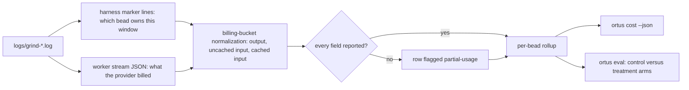

# Cost and evaluation

`ortus cost` answers what a bead cost. `ortus eval` answers whether a harness
change made beads cheaper without making them worse. Both read the same
telemetry, already on disk.

## `ortus cost`

`ortus cost` is offline and read-only: it re-reads `logs/grind-*.log`, so it
costs nothing to re-run and works long after a run finished. The harness marker
lines in that log say which bead each worker window belonged to; the worker's
own JSON stream says what the provider billed for it.

Token counts are reported in the buckets providers price separately — output,
uncached input, cached input — normalized across backends, because the backends
disagree about what their fields mean. Claude keeps cache reads out of
`input_tokens`; Codex folds them in, so its uncached bucket is a subtraction.
An unreported field stays unreported rather than becoming a zero, and the row
is flagged `partial-usage`; dollars appear only where the provider itself
reported a price, which today means Claude and OpenCode but not Codex.

`--runs N` widens the window from the newest log to the newest N, and `--runs 0`
reads every log the repository has. `--issue` narrows to one bead, `--sessions`
reports one row per worker window instead of one per bead, and `--json` emits
the rollup for a program rather than a reader.

## `ortus eval`

Cost per closed bead is the primary metric for the harness-efficiency
comparisons: the judge-gated-versus-plain A/B, the work on choosing a model and
reasoning effort per bead, and the fixed evaluation set that runs those
comparisons on a stable workload. Each of those asks the same question — did
this change make a bead cheaper without making it worse — and each reads the
answer from this rollup rather than instrumenting the worker again.
`--runs 0 --json` is the shape those comparisons consume.

`ortus eval <root>` is that fixed evaluation set. `<root>` is a seat root: one
directory per fixture-and-arm cell. `--matrix` prints the run recipe for every
cell without touching a log. `--run` executes every cell and then prints the
report, which spends real model budget. `--backend` names the backend the
recipe's seats are built for, `--cell-timeout` bounds one cell's commands, and
`--json` emits the report as data.

With no flag, `ortus eval` reads the logs the cells already produced and reports
the comparison: per-arm cost per closed bead, close rate, wall seconds, and the
verdict the thresholds imply. An arm whose backend reported no cached-input
bucket has no cache hit rate to compare, and is named as unmeasured rather than
scored as zero.
