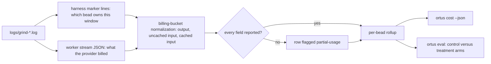

# Cost and evaluation

`ortus cost` answers what a bead cost. `ortus eval` answers whether a harness
change made beads cheaper without making them worse. Both read the same
telemetry, already on disk.

## `ortus cost`

`ortus cost` is offline and read-only: it re-reads `logs/grind-*.log`, so it
costs nothing to re-run and works long after a run finished. The harness marker
lines in that log say which bead each worker window belonged to; the worker's
own JSON stream says what the provider billed for it.

Token counts are reported in the buckets providers price separately — output,
uncached input, cached input — normalized across backends, because the backends
disagree about what their fields mean. Claude keeps cache reads out of
`input_tokens`; Codex folds them in, so its uncached bucket is a subtraction.
An unreported field stays unreported rather than becoming a zero, and the row
is flagged `partial-usage`.

`--runs N` widens the window from the newest log to the newest N, and `--runs 0`
reads every log the repository has. `--issue` narrows to one bead, `--sessions`
reports one row per worker window instead of one per bead, `--tree` rolls
planning and worker windows up together, and `--json` emits the rollup for a
program rather than a reader.

## Where a window's dollars come from

Every row says which of three things its dollar figure is, under `cost_source`:

- `provider` — the provider's own number, from Claude's `result.total_cost_usd`
  or OpenCode's per-step `cost`. Always preferred where it exists.
- `estimated` — the versioned price table in `ortus.core.cost` applied to the
  window's token buckets, because no provider figure was written.
- null — the tokens are known and the price is not, so the dollars stay unset.

The estimate exists because of how a Claude window ends. Grind reaps a worker
as soon as its bead is closed and pushed, since the `/goal` Stop hook would
otherwise hold the session open indefinitely — so the `result` event carrying
the session totals is never written, and those windows used to report null
usage and null dollars even though they were the ones that did the work. Each
`assistant` event also states its own message's usage, repeated on every
content block of that message, so deduplicating by message id and summing
across ids rebuilds the window's billing. Measured against windows that did
write a `result`, the input buckets come out exactly equal; only the output
count runs low, because each message reports what it had produced so far. An
estimate is therefore a floor, and grind gives a worker that met the done bar a
short bounded grace to flush its `result` line before the reap signal so the
provider's figure is used wherever it can be.

A cache write is billed at a rate that depends on how long the entry it wrote
is kept, so the two TTLs are priced separately rather than assumed. Claude's
`cache_creation` object splits the flat cache-write total into the five-minute
and one-hour writes behind it, and the table weights the first at 1.25x the
model's input price and the second at 2x. The flat total stays the bucket
`--json` and the dashboard read, and a write whose TTL nothing in the stream
named keeps the one-hour rate — which is what every write was weighted at
before the split, so an older log is priced exactly as it was before.

The price table is keyed by model family, versioned, and refuses to guess: a
context marker (`claude-opus-5[1m]`) or a dated snapshot suffix resolves to its
family, while a model the table does not name — including the stream's
`<synthetic>` placeholder — leaves the dollars null and marks the row partial.
Codex and Grok report no dollars of their own and are not priced here.

## `ortus cost --tree`

`--tree` answers what the whole tree cost: the `logs/plan-*.log` sessions as a
planner phase, every grind log as worker windows, and the total over the beads
actually closed. A planning session owns no bead of its own, so it is reported
as its own figure rather than attributed to one, and a bead no planner wrote
would not exist to close — a comparison that counted only worker windows would
flatter every arm by the same invisible amount. Cost per closed bead is `n/a`
rather than a number when nothing closed, and the report names how many windows
the provider priced, how many this table priced, and how many went unpriced.

## `ortus eval`

Cost per closed bead is the primary metric for the harness-efficiency
comparisons: the judge-gated-versus-plain A/B, the work on choosing a model and
reasoning effort per bead, and the fixed evaluation set that runs those
comparisons on a stable workload. Each of those asks the same question — did
this change make a bead cheaper without making it worse — and each reads the
answer from this rollup rather than instrumenting the worker again.
`--runs 0 --json` is the shape those comparisons consume.

`ortus eval <root>` is that fixed evaluation set. `<root>` is a seat root: one
directory per fixture-and-arm cell. `--matrix` prints the run recipe for every
cell without touching a log. `--run` executes every cell and then prints the
report, which spends real model budget. `--backend` names the backend the
recipe's seats are built for, `--cell-timeout` bounds one cell's commands, and
`--json` emits the report as data.

With no flag, `ortus eval` reads the logs the cells already produced and reports
the comparison: per-arm cost per closed bead, close rate, wall seconds, and the
verdict the thresholds imply. An arm whose backend reported no cached-input
bucket has no cache hit rate to compare, and is named as unmeasured rather than
scored as zero.
