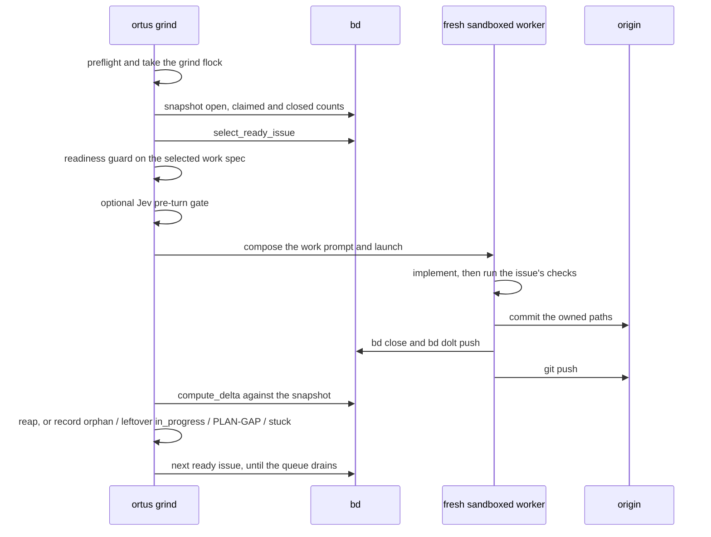
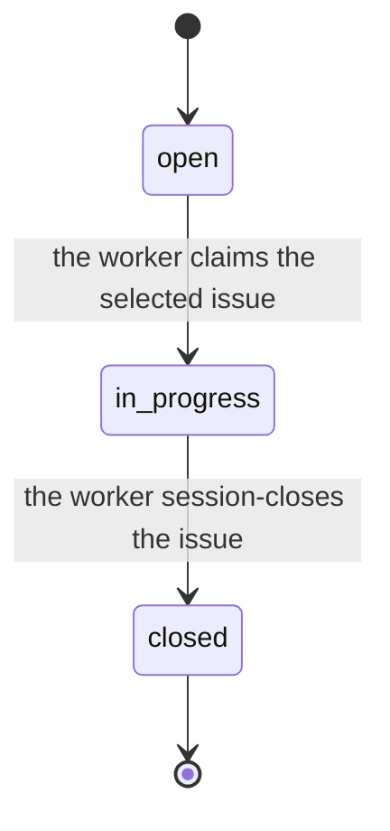

# The grind loop

`ortus grind` is the scheduler. It selects and claims one bd issue, launches one
fresh worker at it, and then reads observable bd and git state to decide what
happened. Backend output is advisory; the tracker and the branch are the record.

## One iteration, end to end



## Implementation readiness

`ortus plan` writes executable tasks using readiness schema v1 in the existing
Beads description, design, and acceptance-criteria fields. Tasks must state
their objective and behavioral context; scope and non-goals; concrete files and
symbols; resolved decisions and compatibility constraints; ordered steps,
dependencies, edge cases, and planning-gap handling; and AC-numbered observable
criteria mapped one-to-one to exact checks plus targeted tests. Epics are
containers and are exempt.

After decomposition, `ortus plan` validates every new task mechanically. It may
run one fresh repair subprocess with the resolved planning profile, updating
only the named issues in place. A repair that creates replacement issues, or
leaves any work spec incomplete, makes planning exit nonzero before work is
claimed.

`ortus grind` applies the same guard immediately before claim. Unready legacy or
manually authored tasks remain open, and their exact missing sections are
printed and written to the grind log for planning or human repair; grind may
continue to a later ready task. If implementation discovers a repository
contradiction or unresolved material choice, the worker records a `PLAN-GAP`
comment, preserves owned-path edits, flags the issue for human handling, and
stops without committing or closing it.

## How an iteration finishes

Each iteration is one fresh worker on one issue. The worker implements the
packet, runs the issue's acceptance checks, and session-closes. It commits
only the paths it owns, closes the issue, and pushes. Grind does not close,
commit, or push on the worker's behalf.

Grind watches observable state. When the closed-issue count has grown since
spawn and HEAD is in sync with origin, it reaps the worker and starts the
next ready issue. A worker that exits without closing leaves the claim
`in_progress`; grind does not treat that as success.

`--tasks N` still bounds how many issues one invocation will drive. An issue
the worker cannot finish stays open or `in_progress` for the next run or for
a human. A finding that names an unresolved product or architecture decision
is a planning gap. The worker records `PLAN-GAP`, leaves the claim, and does
not invent an answer.

## State graph

A bd issue's status outlives any single grind run. The diagram below is
how that status moves under `/goal` grind. The worker claims, session-closes,
or leaves the claim `in_progress` for the next window or a human. It is
generated from `src/ortus/core/lifecycle.py`; changing a status without
regenerating it fails the test suite.

[//]: # (BEGIN GENERATED: state-graph)

[//]: # (Generated from src/ortus/core/lifecycle.py. Do not edit by hand: tests/test_state_graph_docs.py fails and prints the correct block.)

### bd issue status

The statuses Ortus reads and writes through `bd`. A worker claims an open issue, session-closes it, or leaves the claim in_progress for the next window or a human. Leftover in_progress is not reverted to open.



**Every issue transition (4)**

| From | Trigger | To |
| --- | --- | --- |
| `open` | the worker claims the selected issue | `in_progress` |
| `in_progress` | the leftover claim continues in the next window | `in_progress` |
| `in_progress` | grind labels human and stops | `in_progress` |
| `in_progress` | the worker session-closes the issue | `closed` |

[//]: # (END GENERATED: state-graph)

## Session-close protocol

When ending a work session, push your work:

```bash
bd close <id> --reason "..."
git add <owned-paths> && git commit -m "..."
bd dolt push
git push
```

Commit only the paths you own, never `git add -A`. Work is not done until
pushed. The generated `AGENTS.md` repeats this in every project, inside its
managed Ortus block.
