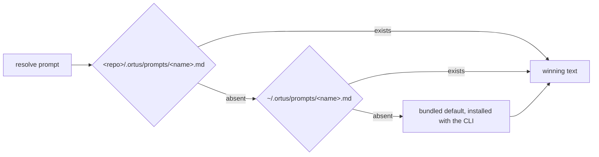

# Runtime prompts

The prompts that drive agent phases (`goal`, `interview`, `plan`) ship inside
the CLI. `ortus init` never copies them into your repo, and the generated
`AGENTS.md` does not point at them. The `prompt` verb is how you read and
override them.

```bash
ortus prompt list [<repo>]          # each prompt: name, winning source, phase, description
ortus prompt show <name> [<repo>]   # resolved text on stdout; header on stderr
ortus prompt show <name> --origin   # print only where the prompt resolves from
ortus prompt eject <name> <repo>    # copy the bundled default to <repo>/.ortus/prompts/
ortus prompt eject <name> --user    # ... or to ~/.ortus/prompts/
```

## Resolution order

Resolution is first-hit-wins across three layers.



| Layer | Path |
|---|---|
| repo override | `<repo>/.ortus/prompts/<name>.md` |
| user override | `~/.ortus/prompts/<name>.md` |
| bundled default | installed with the CLI |

## Reading and overriding

`show` keeps stdout pipe-clean, so `ortus prompt show goal` can feed another
process directly. `eject` copies the bundled default, never a currently winning
override, under a provenance stamp. It requires an explicit destination (a repo
argument or `--user`; there is no cwd default) and refuses to overwrite an
existing override unless you pass `--force`. There is no `eject --all`; eject
the one prompt you intend to own.

`ortus check` reports overrides informationally. It warns when an override has
no provenance stamp, when its stamp shows the bundled default has moved since
the eject, or when a file in `.ortus/prompts/` is not a bundled prompt filename
and is never loaded. An override never fails the check.
